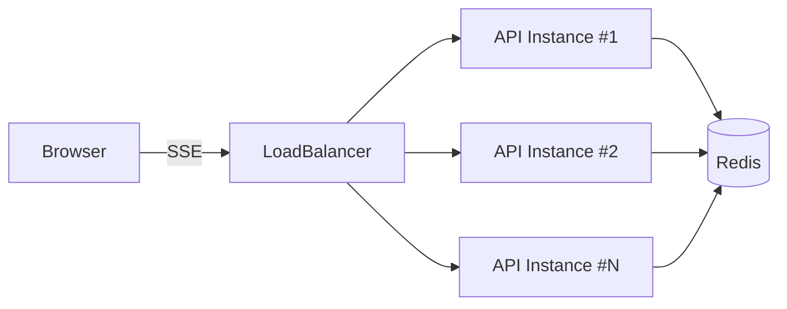
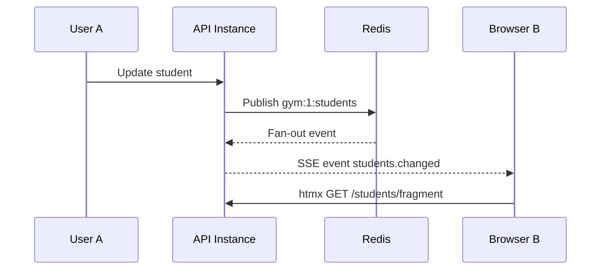

# eventrail

**Event-driven realtime delivery over Server-Sent Events (SSE), powered by Redis.**

`eventrail` is a Go library for building **scalable real-time event delivery** using **Server-Sent Events (SSE)**.
It is designed for **horizontal scalability**, works naturally with **server-side rendering** (e.g. htmx),
and keeps the backend as the **single source of truth**.

The library focuses on **event invalidation**, not state replication.

---

## Why eventrail?

- No polling
- No SPA complexity
- No sticky sessions
- No shared in-memory state between instances

```
CRUD → Redis → SSE → Browser → Fragment refresh
```

---

## Core Concept: Event Invalidation

`eventrail` does **not** push state or diffs to the client.

Instead:
1. The backend emits a lightweight event
2. Browsers receive the event via SSE
3. The frontend decides what to refresh (HTML fragments, tables, dashboards)

This model is robust, scalable, and easy to reason about.

---

## High-Level Architecture



**Key properties:**
- Each API instance manages its own SSE connections
- Redis is the only coordination point
- No instance-to-instance communication
- No sticky sessions required

---

## Event Flow (CRUD → UI Update)



---

## Official Conventions (Contract)

### Redis Channel Naming (Mandatory)

All Redis channels **must** follow:

```
{scope}:{scope_id}:{topic}
```

Examples:
```
gym:1:students
org:42:plans
tenant:9:payments
```

- `scope`: tenant type (gym, org, tenant, etc.)
- `scope_id`: tenant identifier
- `topic`: affected domain or aggregate

Never publish global channels.

---

### SSE Event Naming

```
{EventNamePrefix}.{topic}.{action}
```

Examples:
```
app.students.changed
app.plans.created
```

If `EventNamePrefix` is empty, the event name is just `{topic}.{action}`.

---

### Event Payload Structure

```json
{
  "event_type": "students.changed",
  "data": {
    "id": 123
  }
}
```

---

## Installation

```bash
go get github.com/PabloPavan/eventrail@latest
```

---

## Basic Usage

### 1. Create the SSE Server

```go
// Provide a broker that implements sse.Broker.
// See sse/redis for a Redis Pub/Sub implementation reference.
broker := myBroker

server, err := sse.NewServer(broker, sse.Options{
    Resolver: myResolver,
    Router: func(p *sse.Principal) []string {
        return []string{
            fmt.Sprintf("gym:%d:*", p.ScopeID),
        }
    },
    EventNamePrefix: "app",
})
if err != nil {
    panic(err)
}
```

---

### 2. Register the SSE Route (Chi)

```go
r := chi.NewRouter()

r.Get("/events", func(w http.ResponseWriter, r *http.Request) {
    server.Handler().ServeHTTP(w, r)
})
```

---

## Graceful Shutdown

Use a base context to tie broker subscriptions to your app lifecycle, then call `Close()` when shutting down.
Active SSE handlers also stop when this context is canceled.

```go
ctx, cancel := context.WithCancel(context.Background())

server, err := sse.NewServer(broker, sse.Options{
    Context:  ctx,
    Resolver: myResolver,
    Router:   myRouter,
})
if err != nil {
    panic(err)
}

// On shutdown:
cancel()
server.Close()
```

---

### 3. Publish Events from Your CRUD

```go
pub := server.Publisher()

channel := fmt.Sprintf("gym:%d:students", gymID)

_ = pub.PublishEvent(ctx, channel, sse.Event{
    EventType: "students.changed",
    Data:      json.RawMessage(`{"id":123}`),
})
```

---

### 4. Frontend Example (SSE + htmx)

```html
<div id="students-list"
     hx-get="/students/fragment"
     hx-trigger="load, refresh"
     hx-swap="outerHTML">
</div>

<script>
  const es = new EventSource("/events");

  es.addEventListener("app.students.changed", () => {
    htmx.trigger("#students-list", "refresh");
  });
</script>
```

---

## Authentication & Authorization

`eventrail` is authentication-agnostic.

You provide a `PrincipalResolver`:

```go
type PrincipalResolver interface {
    Resolve(r *http.Request) (*Principal, error)
}
```

The resolver defines:
- **who** the caller is
- **which scope** they belong to

---

## Scalability Characteristics

- One SSE connection per browser
- One Redis subscription per scope per instance
- Linear horizontal scalability
- Works behind standard HTTP load balancers

---

## Development

Run checks locally:

```bash
go vet ./...
golangci-lint run
```

Or via Makefile:

```bash
make vet
make lint
make check
```

---

## License

MIT
